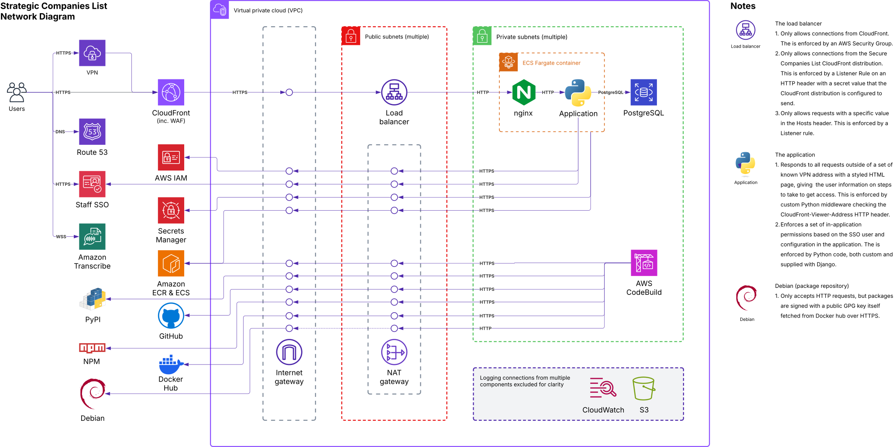

<p align="center">
  
</p>

<h3 align="center">Strategic Companies List</h3><p align="center"><em>A service for maintaining and securely sharing information on top tier companies</em></p>

----

### Contents

- [Running locally](#running-locally)
- [Creating migrations](#creating-migrations)
- [Architecture (network) diagram](#architecture-network-diagram)
- [Infrastructure naming](#infrastructure-naming)
- [Logs](#logs)
- [Provisioning infrastructure](#provisioning-infrastructure)
- [Licenses and attributions](#licenses-and-attributions)

----

## Running locally

```bash
cp sample.env .env
docker compose down && docker compose up --build
```

Visit http://localhost:8000/. Note that on every start of the application, a (mock) SSO user is created or updated with access to the site through the Django group 'Basic access', as well as staff and superuser access, and this user is automatically logged in.

The above uses a development config, which has differences to production around this user setup and around static assets. To use a config closer to production run:

```bash
cp sample.env .env
docker compose down && docker compose --profile prod up --build
```

### Setting up AWS Transcribe locally

The application uses AWS Transcribe for speech-to-text functionality.

For local development, add the following to the `.env` file in the root of the project:
```
TRANSCRIBE_AWS_ACCESS_KEY_ID=your_access_key_here
TRANSCRIBE_AWS_SECRET_ACCESS_KEY=your_secret_key_here
```

## Creating migrations

```bash
docker compose run --build web-dev python manage.py makemigrations
```


## Architecture (network) diagram

How the infrastructure components are connected together can be seen in the following network diagram.




## Infrastructure naming

All infrastructure is named in the pattern `<prefix>-<name>-<suffix>`.

  - `<prefix>` is the name of the service, by default `strategic-companies-list`
  - `<name>` is an optional descriptive name for the specific piece of infrastructure
  - `<suffix>` is the name of the environment, for example `prod`

For example, the name of the production ECS cluster would be `strategic-companies-list-prod`.


## Logs

There are 9 types of logs, sent to 7 locations:

- VPC flow log, saved to the S3 bucket: `<prefix>-vpc-flow-log-<suffix>`
- ALB connection logs, saved to the S3 bucket `<prefix>-lb-connection-logs-<suffix>`
- ALB access logs sent, ot the S3 bucket `<prefix>-lb-access-logs-<suffix>`
- Logs from standard out and standard error of the ECS task itself, saved to the CloudWatch log group  `<prefix>-ecs-task-<suffix>`. These contain:
  - nginx logs, configured to use the CloudFront-Viewer-Address header for its IP address
  - Web server logs
  - Django logs
- PostgreSQL logs for the PostgreSQL database, saved to the CloudWatch log group `/aws/rds/instance/<prefix>-<suffix>/postgresql`
- Upgrade logs for the PostgreSQL database, saved to the CloudWatch log group `/aws/rds/instance/<prefix>-<suffix>/upgrade`
- Logs from CodeBuild, saved to the CloudWatch log group `<prefix>-codebuild-<suffix>`

Both CloudWatch and S3 logs have a retention of 3653 days (~10 years).


## Provisioning infrastructure

> [!IMPORTANT]
> The instructions below use Terraform to provision infrastructure for Strategic Companies List environments (dev, prod, etc), the "entry-point" of each is an internet-facing Application Load Balancer (ALB). However, for flexibility, especially in multi-account setups, there are manual steps needed after the Terraform has run to make this ALB actually acessible. Be sure to run `terraform output strategic_companies_list` after provisioning the environment to find what these steps are.
>
> Note that manual changes to secrets in AWS Secrets manager typically feed a forced deployment of the ECS service to take effect.
>
> In future versions it is possible that these steps are incorportated into the Terraform.

AWS infrastructure for running the strategic-companies-list is defined through Terraform in [infra/](./infra/), although each environment needs manual bootstrapping. There are various options, but one possibility:

1. Create or get access to an AWS account for running the infrastructure.

2. Install the [AWS CLI](https://aws.amazon.com/cli/) if you don't have it already.

3. Create an AWS profile configured for the AWS CLI, for example `my-profile-name`. See the the [AWS Cli documentation](https://docs.aws.amazon.com/cli/latest/userguide/getting-started-quickstart.html) for more details.

4. For each environment, create an S3 bucket of any name (for storing the Terraform state file).

5. For each environment, create a DynamoDB table of any name, and with a a string `LockID` partition key (for storing a _lock_ that prevents multiple changes to infrastructure at once).

6. For each environment, create a directory _outside_ of a cloned copy of this repository. A typical file layout would be the following.

   ```
    any-folder
      ├── stategic-companies-list (a cloned copy of this repository)
      └── stategic-companies-list-deploy
          ├── dev
          └── prod
    ```

7. In each environment directory, create a `main.tf` as follows, replacing the `<...>`` patterns with the S3 bucket name, DynamoDB table, and environment name, and populating the `module` with additional variables defined in [infra/variables.tf](./infra/variables.tf)

    ```hcl
    terraform {
      backend "s3" {
        region         = "eu-west-2"
        encrypt        = true
        bucket         = "<bucket)name>"
        key            = "<environment_name>.tfstate"
        dynamodb_table = "<dynamodb_table_name>"
      }
    }

    provider "aws" {
      region = "eu-west-2"
    }

    module "strategic_companies_list" {
      source = "../../strategic-companies-list/infra"

      external_domain_name = "scl.my-domain.gov.uk"        # The user-facing domain
      internal_domain_name = "scl.prod.my-domain.digital"  # The domain of the ALB

      authbroker_url       = "https://sso-domain.gov.uk"   # The URL of Staff SSO
      authbroker_client_id = "12345abcdef"                 # The Client ID of the app in Staff SSO
    }

    output "strategic_companies_list" {
      value     = module.strategic_companies_list
      sensitive = true
    }
    ```

8. If you configured AWS CLI though SSO access, run:

   ```bash
   AWS_PROFILE=my-profile-name aws sso login
   ```

9. In each new environment's directory run

   ```bash
   AWS_PROFILE=my-profile-name terraform init
   ```

   and then

   ```bash
   AWS_PROFILE=my-profile-name terraform apply
   ```

10. Find the manual steps needed:

   ```bash
   AWS_PROFILE=my-profile-name terraform output strategic_companies_list
   ```

11. (Optional) Use [direnv](https://direnv.net/) to avoid having to use `AWS_PROFILE=my-profile-name` for future terraform commands.


## Licenses and attributions

The code of Strategic Companies List is licensed under the [MIT License](./LICENSE).

However, the [Secure Companies List logo](./assets/scl-logo.svg) is not licensed in the MIT License: it is a modified version of [Nursila's strategy icon](https://thenounproject.com/icon/strategy-7052985/), purchased via a Noun project subscription.
