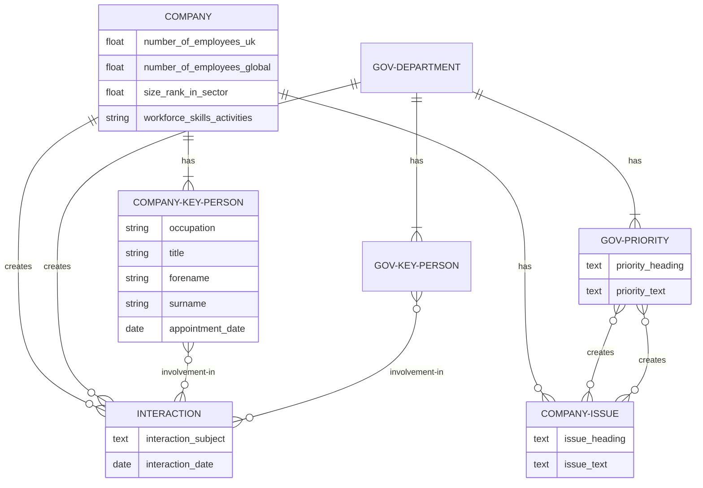

```mermaid
erDiagram
    COMPANY ||--|{ COMPANY-KEY-PERSON: has
    COMPANY ||--o{ COMPANY-ISSUE: has
    COMPANY ||--o{ INTERACTION: creates
    GOV-DEPARTMENT ||--|{ GOV-KEY-PERSON: has
    GOV-DEPARTMENT ||--o{ INTERACTION: creates
    GOV-DEPARTMENT ||--|{ GOV-PRIORITY: has
    GOV-PRIORITY }o--o{ COMPANY-ISSUE: creates
    GOV-PRIORITY }o--o{ COMPANY-ISSUE: creates
    COMPANY-KEY-PERSON }o--o{ INTERACTION: involvement-in
    GOV-KEY-PERSON }o--o{ INTERACTION: involvement-in
    COMPANY{
        float number_of_employees_uk
        float number_of_employees_global
        float size_rank_in_sector
        string workforce_skills_activities
    }
    COMPANY-KEY-PERSON{
        string occupation
        string title
        string forename
        string surname
        date appointment_date
    }
    COMPANY-ISSUE{
        text issue_heading
        text issue_text
    }
    GOV-PRIORITY{
        text priority_heading
        text priority_text
    }
    INTERACTION{
        text interaction_subject
        date interaction_date
    }
    
```